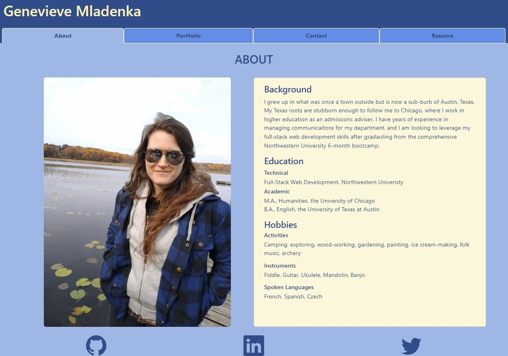

# Portfolio
Portfolio built with React

## Description

This is a portfolio built with React which demonstrates the projects I have completed, and the technologies I have learned. I wanted build this application to learn React, using components, useState, and other associated technologies. 

## Table of Contents 

- [Installation](#installation)
- [Usage](#usage)
- [Credits](#credits)
- [License](#license)

## Installation

This project is not intended for installation, but you are welcome to clone the repository for a local installation. 

## Usage

Users can view the creators portfolio with this React applicaiton. Users will automatically be brought to the about page, where they can view a header with navigation tabs: About, Portfolio, Contact, Resume. The footer at the bottom of the application has links to the creator's GitHub, LinkedIn, and Twitter. 

Users can navigate to the Portfolio tab to view six recent projects the creator has developed; hovering over the image of each project will review a link to the project's deployed application and GitHub repository, as well as a list of technologies used and a description. 

Users can navigate to the Contact tab to fill out the contact form with a name, email, and message. Users will recieve error messages if any field is left blank or invalid. Upon submission of a valid form, users will receive a success message. 

Users can navigate to teh Resume tab to view a list of technologies with which the creator has experience. Users are also able to download a pdf of the creator's resume. 

## Credits

N/A

## License

